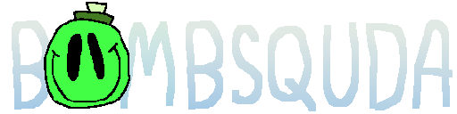
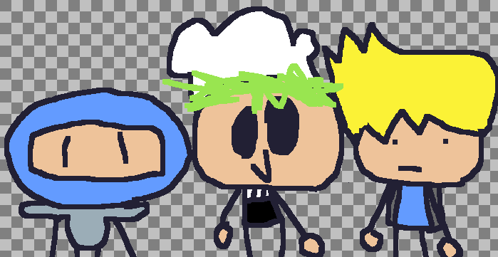

# BombSquda

    <picture>
        
    </picture>

The repository for BombSquda, a stupid modpack for BombSquad. 
This repository was made primarily to allow anyone to edit the code.

## What the fuuuhhh is BombSquda bro???

    <picture>
        
    </picture>

BombSquda (formerly known as BombSquda; Mell's stupid Modpack) 
is a modpack for BombSquad that adds a lot of changes to vanilla 
assets and gameplay, adds ~3 new powerups, 
buncha gameplay mechanics, a LOT of randomization, 
and 1 (yes, ONE) new coop level.

## So how can I help develop... and.. stuff??

    <picture>
        
    </picture>

Download Github Desktop and clone the repository, 
make changes to some files, commit and push your changes, then make a pull request. 
If everything looks fine, i'll accept the merge. :)

## Anyone helped make this? Credits and such?

    <picture>
        
    </picture>

Yes, actually! 
GummyBoiYT - Snake Shadow's character, Ninjageon and Metal Music's code, and Orangecap's old model. 
Buddie - Orangecap's character. Not the model, just the character. :^) 
Lemon - Voice-acted Mell and also gave some great ideas like the spongebob powerup 
Various sources - Sounds, music, and everything. There's WAY too many sources to list, so you're better off just searching for em. 
Mell - The original sound pack, BombSquad 21st century edition and making this entire modpack.

## Why does this modpack suck?

Yes

